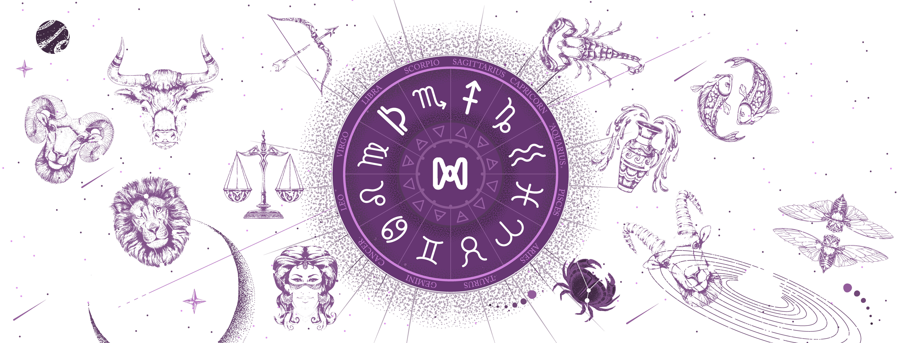

# 📖 Meta-zodiac

Since the dawn of mankind, humans have recorded their stories, myths and legends in the star-studded night sky. No matter what culture you grew up in, the heavens have long been the ultimate story for humans to record their thoughts, beliefs and experiences. Humans have associated groups of stars with their mythological figures or devices, calling them "constellations. In ancient Egypt, the beginning of the year was determined by observing the Kai sunrise of Sirius; in some regions, the ancient technique of determining orientation through stellar observations still survives; and these constellations are widely used in navigation and have been the means of determining the orientation of the sky in almost all civilizations.

The twelve constellations of the universe actually appeared 5,000 years ago, and they were one of the essential components of astrology. The Babylonians made a calendar of the seasons according to the stars and used it to divine the fate of the country and its people. In fact, this method of divination, which is similar to the ancient Chinese Zimmer Dipper, is based on the relationship between the diviner and the stars, accounting for all aspects of his or her life's fortune.

In 1930, the International Astronomical Union divided the sky into eighty-eight official constellations using precise boundaries and based on ancient Greek myths handed down from the Middle Ages. Although the importance of constellations has relatively diminished in modern times, they have not lost their charm for astronomy enthusiasts.

Through their fascinating legends, constellations have served to create a wave of astronomical fervor in the popularization of astronomy.

Now, the Metaverse Age is also coming to us. And we, a metaverse constellation NFT platform initiated by the Metaworld team and jointly built with several astronomy experts and well-known divination masters - Meta-zodiac will be launched soon. Meta-zodiac will use our rich astronomical knowledge to combine advanced The technology of the metaverse can better present the wonderful constellation stories and magical divination skills to everyone. Let more people know and learn about the stories and functions of constellations in the metaverse world, so that every user can obtain more luck of his own in various ways while learning and participating. Let luck always be with you through every good moment of your life.
