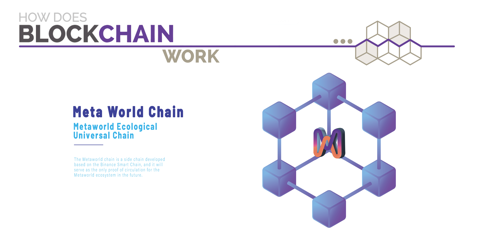

# 💻 Technology

Due to the positive and supportive reception of our Metaworld law idea posted on the web, we have received resumes sent from all over the world, which honors us and gives us the ability to recruit developers and recruit initial community members on the web. However, we understand that considering the future of the meta-world law, technology is the foundation for stable development. We went through a selection and testing process and finally selected Andy Ho as the Chief Technical Officer and led the engineers under him to be responsible for the development and maintenance of the Meta-zodiac project. Of course, we have also hired several talented advocates who sent us their resumes to serve as project advisors during the development of the Metastar project. We believe in the power of community talent because they will convey to me everything our market needs. This is true, and it will greatly advance the efficiency of building Metaboundary Star.

### Decentralization and Blockchain

While we require high technical standards for our platform, we believe that the ecological mechanism of the meta-world law does not require a fully decentralized public blockchain. We have learned that while our users care about blockchain technology, they are focused on the benefits it can bring, rather than decentralizing too many functions. As long as we provide a tamper-proof, distributed ledger that ensures scarcity and allows our players to own and trade their assets, that's enough for now. The technology of blockchain has been developed for nearly 10 years, and the blockchain environment is now more and more mature, which gives us more options. From the perspective of scalability, the programmability of BSC greatly increases our future expandability, and Coin On Chain has a more competitive underlying system support, which will create favorable conditions for the ecological development and value interoperability of the meta-world law.

### Metaworld Chain BSC Side Chain

An innovative BSC public chain based on the adopted PoSA (Proof of Stake Authority) consensus algorithm and its combination of the functional advantages of the Delegated Proof of Stake (DPoS) and Proof of Authority (PoA) mechanisms. We are in the process of creating a Meta World Chain, an Binance Smart Chain made specifically for the Meta World Chain, and we are looking for talented partners in traditional gaming, crypto and irreplaceable tokens from the community's resumes, to use the BSC's compatibility with the existing Ether Virtual Machine EVM ( Ethereum Virtual Machine) to develop a truly decentralized sidechain that falls under the laws of the meta-world. These excellent partners from the community will also serve as the validators of Meta World Chain network and build the future ecology of Meta World together.
