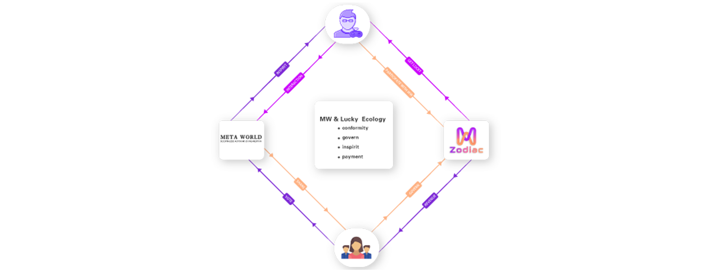

# 🪙 Token Issuance and Distribution

**MW is a BSC governance token issued by the Metaworld team to enforce the Metaworld laws, through which MW holders can pledge their tokens and participate in key governance votes for all projects in the Metaworld ecosystem. And as a reward, they will also be rewarded accordingly in projects and games. In Meta-zodiac, players can then earn Lucky while playing various games and through user-generated content programs.**

Our goal with Meta Zodiac is to align incentives between gamers and developers scientifically and admirably. We are committed to building Meta Zodiac into a game that is truly governed and run by the community of players, which must be approached with care. That's why from the very beginning of our creation, we have a very detailed allocation scheme for Tokens to avoid disrupting our financial ecosystem by some capital institutions entering and taking a majority share of Tokens. Through the efforts of the community, we believe that a truly decentralized organization will be presented to everyone, which will open up endless possibilities.

In addition to the many existing play mechanisms such as redeeming blind boxes, praying for blessings, collecting starlight, constellation matching, and wishing pools, Meta Realm Star is also working with renowned strategy experts to add more Token flow mechanisms from constellation NFT sales, black hole expeditions, interstellar treasure hunts, and many other forms in the future, in conjunction with the community's favorite preferences. With the emergence of innovative mechanisms, Meta Realm Star will establish a healthy financial flow environment so that community players can continue to expand the infinite possibilities in the process of participation.
