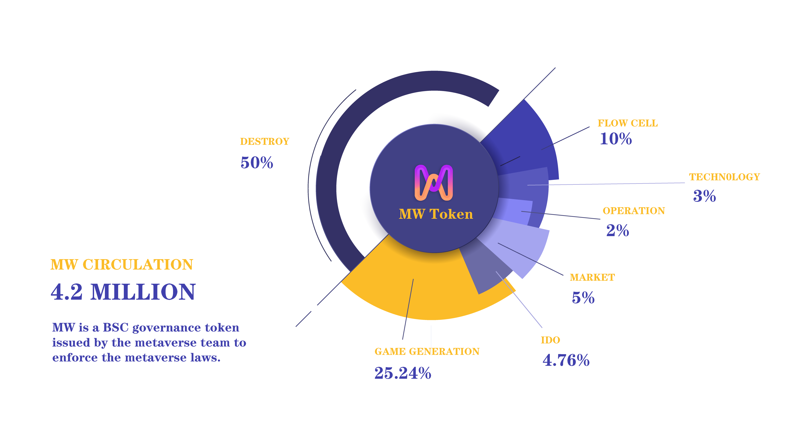

# 🧮 Distribution ratio

Total distribution: 4200000

Distribution ratio.

| IDO                    | Operations         | Technology          | Market Incentives   | Mobility                 | Games                    | Destruction           |
| ---------------------- | ------------------ | ------------------- | ------------------- | ------------------------ | ------------------------ | --------------------- |
| 
4.76% 200000
 | 
2% 84000
 | 
3% 126000
 | 
5% 210000
 | 
10% 

420000
 | 
25.24% 1060000
 | 
50% 2100000
 |

### Game Mining

25.24% of the issue volume can be earned by participating in the game. The goal of this is to encourage players across the network to discover token rewards in MetaZodiac and to grant that fractional ownership and shares to active players of MetaZodiac.

We plan to use the game to earn a portion of the launch Lucky tokens to reward key actions in our ecosystem. Ways to earn Lucky are for example

**Starlight prayers**

**Constellation matching**

**Collecting starlight**

**Multiplayer blessings**

**Astrological Divination**

**Wishing Pool**

Players earn Lucky tokens through simple gameplay. Players bring value to the entire ecosystem and they should be rewarded.

### Marketplace Incentives

As a Decentralized Autonomous Organization open to the entire network, we want more active users to join our ecosystem, and as an incentive, we have decided to award 5% of the issue as a share of the support market to those community players who contribute to the market.

### Mobility

When the Metaworld organization publicly issues the Meta-Zodiac NFT, 10% of the issue volume of MW will be invested in liquidity, creating a liquid trading pool of incredible volume. We believe that good liquidity facilitates the player discovery of value, which is important for the development of MW and a key step towards maturity. This will trade for maximum maneuverability space for MW owners.

### Destruction

To ensure an orderly and steady increase in token value, we have set up a complex destruction mechanism in the game, where these destroyed tokens are permanently removed from circulation and can never again reach the market. We set 50% of the tokens to be destroyed permanently by punching them into a black hole.

### Technical Team

The technical team is the core of Metaworld law, and they contribute to the perfect functioning of the entire ecosystem at the technical level, both in the early stages of construction and in the later stages of maintenance, they are crucial. That's why we award 3% of the release volume to each of our technical team members.

### Operation Team

The market operation of Meta-zodiac will be handed over to a well-known operation team to take care of the market, and we have divided 2% of the issue volume of tokens to them, this is to guarantee that Meta-zodiac will be strongly promoted in the future ecological development, and we believe they will guarantee the smooth running of the work of Meta World Ecology.
