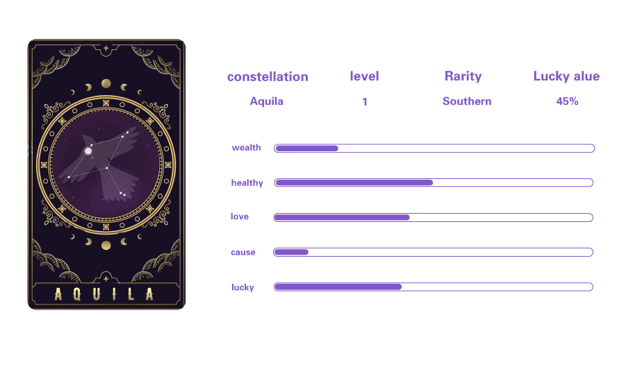

# 🕎 Southern Constellation

Constellation ：

Indian Sitting, Southern Cross, Mountain Case, Cetus, Eridanus, Orion, Monoceros, Canis Minor, Hydra, Giants, Corvus, Lupus, Southern Corona, Tiantan, Grus, Phoenix, Clock Seat, Pictorial Seat, Vela Seat, Compass Seat, Pisces Australis, Fornax Seat, Sculpture Seat, Canis Major, Poop Seat, Ruler Seat, Cuckoo Seat, Flying Fish, Carina, Sky Swallow, Hydra, Sextant, Microscope, Southern Triangle, Centaur, Peacock, Auriga, Columba, Lepus, Compass, Cyclops, Reticulum, Swordfish, Fox, Dolphin, Pony, Pegasus, Triangle

Rarity ： 82.5%

Quantity ： 48

Southern Constellation is the most common constellation and contains a small amount of energy (the ability to obtain LUCKY), which can be obtained through the lucky box. The 5 attributes of love, career, wealth, health and luck of this type of constellation are all low.
