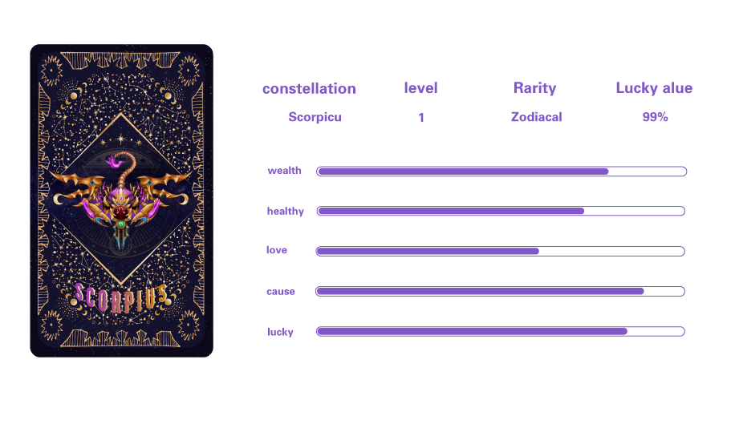

# ✡ Zodiacal constellations

Constellation ：

Aries, Taurus, Gemini, Cancer, Leo, Virgo, Libra, Scorpio, Sagittarius, Capricorn, Aquarius, Pisces

Rarity ： 5%

Quantity ： 12

Zodiacal constellations are rare constellations that contain a lot of energy (the ability to gain LUCKY) and can be obtained through lucky boxes. The 5 attributes of love, career, wealth, health and luck of this type of constellation are all high, and there are certain attributes that are close to full level.
